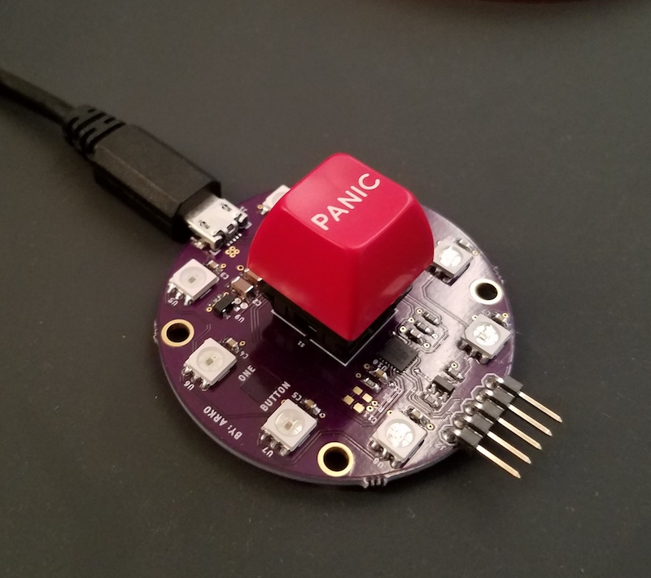
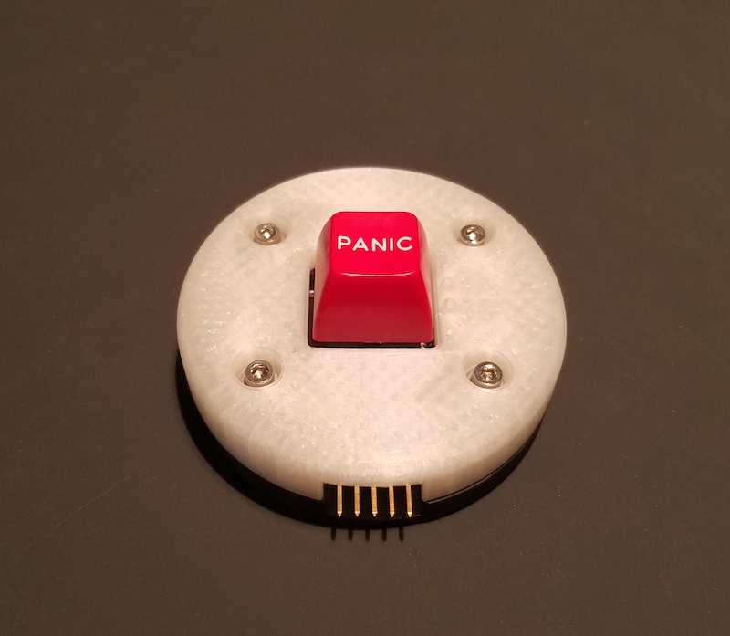
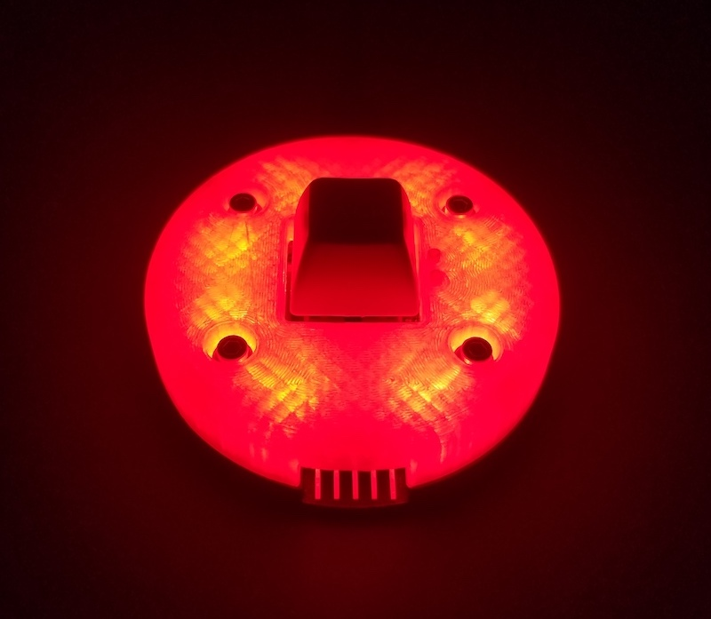
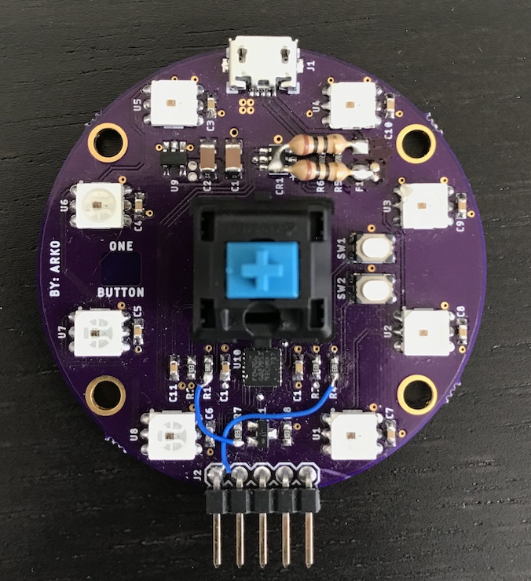
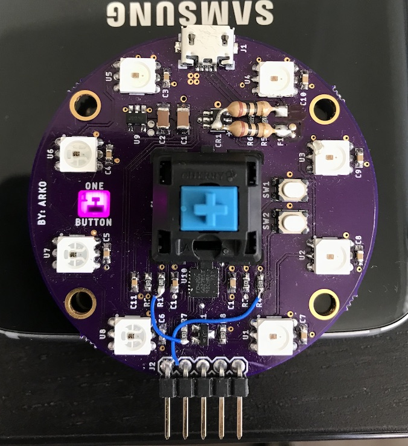

# OneButton

The OneButton is a programmable single-key USB Keyboard with RGB LED's.

The OneButton serves no single purpose, but rather is designed to be programmed for multiple uses.

Possible Applications: 
- Generate pre-scripted USB keystrokes (included in the example code)
- Serve as a "Soft" E-STOP button with color LED's to indicate state
- Interface with a desktop API to perform other actions (i.e. - Indiciate a new Tweet notification by turning LED's Blue. Pressing the key opens Twitter.)
- The possiblities are not endless!

The OneButton includes six programmable RGB LED's because everyone loves blinky lights!  

...and easter eggs! 

Included in this GitHub:
- Firmware: Example code written in C++ and Rust 
- Hardware: Schematic, Board, Gerber, and 3D printable enclosure CAD files